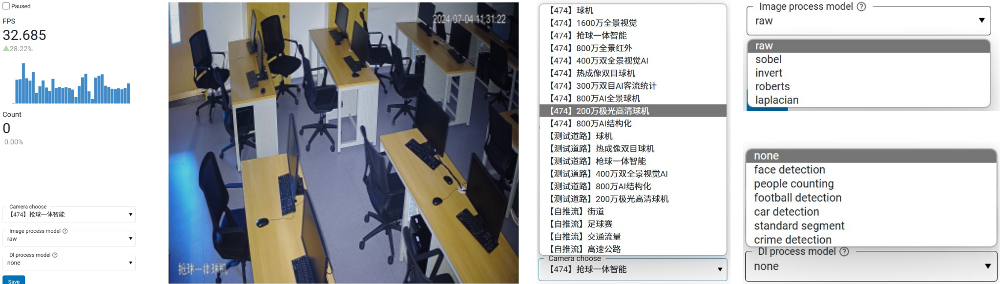

# LiveStreamer

一个使用基于[Panel](https://github.com/holoviz/panel)实现的直播流媒体播放以及图像处理程序。

## 快速使用

```bash
sudo apt-get install ffmpeg
git clone https://github.com/lankoestee/livestreamer.git
cd livestreamer
pip install -r requirements.txt
bash push.sh # 用于推送视频流
```

在另一个终端中运行：

```bash
panel serve app.py
```

随后在浏览器中打开`http://localhost:5006/app`即可查看网页APP。

## 简单功能



如上图所示，可以简单实现直播流媒体的播放以及简单图像处理和基于深度学习的图像处理功能。其中深度学习模块需要手动下载对应的模型文件以及整理pipeline，具体可修改的地方可参照`models/dlprocess.py`文件。并修改`app.py`文件中的对应部分，均已使用显著注释标注。